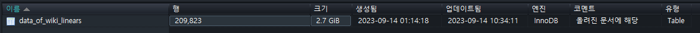
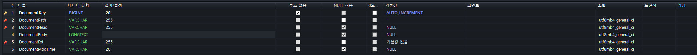
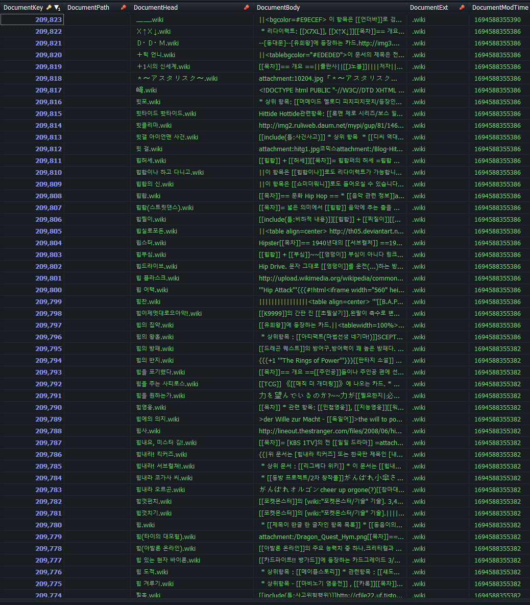

# enha_monimarkup_db

This repository has been forked from [forkwikiman/enha_monimarkup](https://github.com/forkwikiman/enha_monimarkup).

## Description
Provide a ported to MySQL file.

## Images

## Password
The password is `xi`.

## Resources
- [How to split a large file into smaller files with Bandizip](https://en.bandisoft.com/bandizip/help/how-to-split-a-large-file-into-smaller-files-with-bandizip/)
- [Bandizip Official Site](https://en.bandisoft.com/bandizip/)
